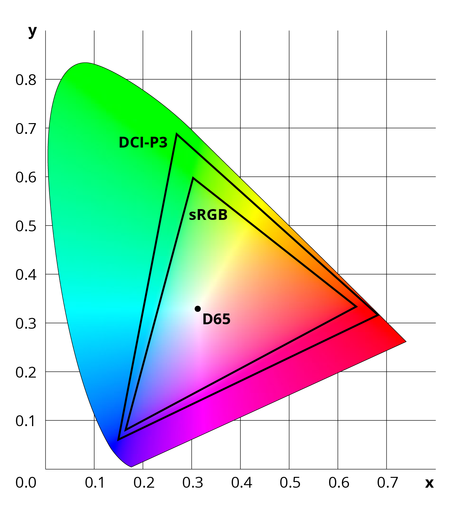

<style type="text/css">

.rgbGradient { background-image: linear-gradient(to right, #ffff00 0%, #ffff00 25%, #bfbf3f 25%, #bfbf3f 50%, #7f7f7f 50%, #7f7f7f 75%, #3f3fbf 75%, #0000ff 75%, #0000ff 100%) ;}.labGradient { background-image: linear-gradient(to right, #fffe00 0%, #fffe00 25%, #e9c476 25%, #e9c476 50%, #c98aa9 50%, #c98aa9 75%, #974fd5 75%, #0000ff 75%, #0000ff 100%) ;}.hlsGradient { background-image: linear-gradient(to right, #feff00 0%, #feff00 25%, #3fff00 25%, #3fff00 50%, #00ff7f 50%, #00ff7f 75%, #00bfff 75%, #0000ff 75%, #0000ff 100%) ;}.rgbGradientL { background-image: linear-gradient(to right, #ffff00 0%, #0000ff 100%) ;}.labGradientL { background-image: linear-gradient(to right, #fffe00 0%, #fefc13 1.0101010101010102%, #fdfa1e 2.0202020202020203%, #fcf727 3.0303030303030303%, #fcf52e 4.040404040404041%, #fbf334 5.05050505050505%, #faf039 6.0606060606060606%, #f9ee3e 7.07070707070707%, #f9eb42 8.080808080808081%, #f8e946 9.090909090909092%, #f7e74a 10.1010101010101%, #f6e44e 11.11111111111111%, #f5e252 12.121212121212121%, #f4df55 13.131313131313133%, #f4dd58 14.14141414141414%, #f3db5b 15.151515151515152%, #f2d85e 16.161616161616163%, #f1d661 17.17171717171717%, #f0d464 18.181818181818183%, #efd167 19.19191919191919%, #eecf6a 20.2020202020202%, #edcd6c 21.21212121212121%, #ecca6f 22.22222222222222%, #ebc871 23.232323232323232%, #eac574 24.242424242424242%, #e9c376 25.252525252525253%, #e8c179 26.262626262626267%, #e7be7b 27.27272727272727%, #e6bc7d 28.28282828282828%, #e5ba80 29.292929292929294%, #e3b782 30.303030303030305%, #e2b584 31.313131313131315%, #e1b386 32.323232323232325%, #e0b088 33.33333333333333%, #dfae8b 34.34343434343434%, #deac8d 35.35353535353536%, #dca98f 36.36363636363637%, #dba791 37.37373737373738%, #daa593 38.38383838383838%, #d8a295 39.39393939393939%, #d7a097 40.4040404040404%, #d69e99 41.41414141414141%, #d49b9b 42.42424242424242%, #d3999d 43.43434343434344%, #d2979f 44.44444444444444%, #d094a1 45.45454545454545%, #cf92a3 46.464646464646464%, #cd90a4 47.474747474747474%, #cc8da6 48.484848484848484%, #ca8ba8 49.494949494949495%, #c889aa 50.505050505050505%, #c786ac 51.515151515151516%, #c584ae 52.52525252525253%, #c482b0 53.535353535353536%, #c27fb1 54.54545454545454%, #c07db3 55.55555555555556%, #be7bb5 56.56565656565656%, #bd78b7 57.57575757575758%, #bb76b9 58.58585858585859%, #b974ba 59.59595959595959%, #b771bc 60.60606060606061%, #b56fbe 61.61616161616161%, #b36dc0 62.62626262626263%, #b16ac2 63.63636363636363%, #af68c3 64.64646464646465%, #ad66c5 65.65656565656566%, #ab63c7 66.66666666666666%, #a961c9 67.67676767676768%, #a75eca 68.68686868686868%, #a45ccc 69.6969696969697%, #a25ace 70.70707070707071%, #a057cf 71.71717171717171%, #9d55d1 72.72727272727273%, #9b52d3 73.73737373737373%, #9850d5 74.74747474747475%, #954dd6 75.75757575757575%, #934bd8 76.76767676767676%, #9049da 77.77777777777779%, #8d46db 78.78787878787878%, #8a44dd 79.7979797979798%, #8741df 80.8080808080808%, #843ee0 81.81818181818183%, #803ce2 82.82828282828282%, #7d39e4 83.83838383838383%, #7937e5 84.84848484848484%, #7634e7 85.85858585858585%, #7231e9 86.86868686868688%, #6e2eea 87.87878787878788%, #692cec 88.88888888888889%, #6529ee 89.8989898989899%, #6026f0 90.9090909090909%, #5b23f1 91.91919191919192%, #551ff3 92.92929292929293%, #4f1cf5 93.93939393939394%, #4818f6 94.94949494949495%, #4115f8 95.95959595959596%, #3810fa 96.96969696969697%, #2d0bfb 97.97979797979798%, #1e05fd 98.98989898989899%, #0000ff 100%) ;}.hlsGradientL { background-image: linear-gradient(to right, #feff00 0%, #f7ff00 1.0101010101010102%, #efff00 2.0202020202020203%, #e7ff00 3.0303030303030303%, #e0ff00 4.040404040404041%, #d8ff00 5.05050505050505%, #d0ff00 6.0606060606060606%, #c8ff00 7.07070707070707%, #c1ff00 8.080808080808081%, #b9ff00 9.090909090909092%, #b1ff00 10.1010101010101%, #a9ff00 11.11111111111111%, #a2ff00 12.121212121212121%, #9aff00 13.131313131313133%, #92ff00 14.14141414141414%, #8bff00 15.151515151515152%, #83ff00 16.161616161616163%, #7bff00 17.17171717171717%, #73ff00 18.181818181818183%, #6cff00 19.19191919191919%, #64ff00 20.2020202020202%, #5cff00 21.21212121212121%, #54ff00 22.22222222222222%, #4dff00 23.232323232323232%, #45ff00 24.242424242424242%, #3dff00 25.252525252525253%, #36ff00 26.262626262626267%, #2eff00 27.27272727272727%, #26ff00 28.28282828282828%, #1eff00 29.292929292929294%, #17ff00 30.303030303030305%, #0fff00 31.313131313131315%, #07ff00 32.323232323232325%, #00ff00 33.33333333333333%, #00ff07 34.34343434343434%, #00ff0f 35.35353535353536%, #00ff17 36.36363636363637%, #00ff1e 37.37373737373738%, #00ff26 38.38383838383838%, #00ff2e 39.39393939393939%, #00ff36 40.4040404040404%, #00ff3d 41.41414141414141%, #00ff45 42.42424242424242%, #00ff4d 43.43434343434344%, #00ff54 44.44444444444444%, #00ff5c 45.45454545454545%, #00ff64 46.464646464646464%, #00ff6c 47.474747474747474%, #00ff73 48.484848484848484%, #00ff7b 49.494949494949495%, #00ff83 50.505050505050505%, #00ff8b 51.515151515151516%, #00ff92 52.52525252525253%, #00ff9a 53.535353535353536%, #00ffa2 54.54545454545454%, #00ffaa 55.55555555555556%, #00ffb1 56.56565656565656%, #00ffb9 57.57575757575758%, #00ffc1 58.58585858585859%, #00ffc8 59.59595959595959%, #00ffd0 60.60606060606061%, #00ffd8 61.61616161616161%, #00ffe0 62.62626262626263%, #00ffe7 63.63636363636363%, #00ffef 64.64646464646465%, #00fff7 65.65656565656566%, #00feff 66.66666666666666%, #00f7ff 67.67676767676768%, #00efff 68.68686868686868%, #00e7ff 69.6969696969697%, #00e0ff 70.70707070707071%, #00d8ff 71.71717171717171%, #00d0ff 72.72727272727273%, #00c8ff 73.73737373737373%, #00c1ff 74.74747474747475%, #00b9ff 75.75757575757575%, #00b1ff 76.76767676767676%, #00a9ff 77.77777777777779%, #00a2ff 78.78787878787878%, #009aff 79.7979797979798%, #0092ff 80.8080808080808%, #008bff 81.81818181818183%, #0083ff 82.82828282828282%, #007bff 83.83838383838383%, #0073ff 84.84848484848484%, #006cff 85.85858585858585%, #0064ff 86.86868686868688%, #005cff 87.87878787878788%, #0055ff 88.88888888888889%, #004dff 89.8989898989899%, #0045ff 90.9090909090909%, #003dff 91.91919191919192%, #0036ff 92.92929292929293%, #002eff 93.93939393939394%, #0026ff 94.94949494949495%, #001eff 95.95959595959596%, #0017ff 96.96969696969697%, #000fff 97.97979797979798%, #0007ff 98.98989898989899%, #0000ff 100%) ;}


.gradient-01 {
  background-image: linear-gradient(90deg, #be6a39, #64badf);
}
.gradient-02 {
  background-image: linear-gradient(90deg, #ea4c3c, #ddf536);
}

.gradient-02-hsl {
  background-image: linear-gradient(90deg, hsl(6, 81%, 58%), hsl(68, 91%, 59%));
}

.test-patchs {
  width: 100%;
  height: 6rem;
}


.bg-red-srgb{
  background: rgb(234, 51, 35);
}

.bg-red-srgb-p3{
  background: rgb(255, 0, 0);
}

@media (color-gamut: p3) {
  .bg-red-srgb-p3 {
    background: rgb(234, 51, 35);
  }
}


.gradient-hsl {
  background-image: linear-gradient(90deg, hsl(60, 100%, 50%), hsl(240, 100%, 50%));
}


</style>


<!--
<div class="test-patchs gradient-01"></div>
-
<div class="test-patchs gradient-02"></div>
-
<div class="test-patchs gradient-02-hsl"></div>
-
<div class="test-patchs bg-red-srgb-p3"></div>
-
<div class="test-patchs bg-red-srgb"></div>

 -->


## Publisher 2 · 2020

<hr />

## Lizenzen
Dieser Text ist von Stefan Huber unter der Lizenz [CC-BY-SA 4.0](https://creativecommons.org/licenses/by-sa/4.0/) veröffentlicht. [Publisher](https://publisher.ch/) erhält das Recht die Inhalte ohne Copyleft (Share Alike) zu publizieren.


<hr />


# Farben im Web – unterscheiden und interpolieren


<lead>

Farben können sich entscheidend auf die Gestaltung und deren Anmut auswirken. Doch nicht nur für das Design ist die Wahl entscheidend, sondern auch um Barrierefreiheit zu gewähren, muss der Umgang mit Farben überlegt sein. Ob zwischen zwei Farben eine Kontrast benötigt wird oder aber dazwischen interpoliert werden soll kann ganz unterschiedliche Überlegungen nach sich ziehen.

</lead>

## Farbraum im Browser
Grundsätzlich sind in der [CSS-Farbspezifikation](https://www.w3.org/TR/css-color-3/#SRGB) für das Web alle Farben im Farbraum sRGB spezifiziert. Somit werden in den allermeisten Fällen mittels CSS die Farben auf einer Website definiert, die für heutige Verhältnisse nicht in einem sehr grossen Farbraum liegen. Aktuelle Apple Geräte haben zum Beispiel den Farbraum DCI-P3 welcher ein um etwa 25 % grösseres Gamut (Farbumfang) ermöglichen würde. Somit wird nur ein Teil der möglichen Fähigkeit heutiger Bildschirme ausgenutzt und Farben wirken unnötig verwaschen.  
Als wäre das nicht schon unglück genug, kommt noch dazu, dass Farben meist als 8-Bit-Werte (0 – 255) gespeichert werden. Somit können feine Farbunterschiede nicht abgebildet werden oder Farbverläufe können stufig wirken.


*Im direkten Vergleich sieht man, wie die beiden Farbräume sich relativ stark im Gamut unterscheiden*


## Bilder
Sobald Bilder an einen modernen Browser übermittelt werden könnten eingebettete Farbprofile mitgesendet werden, was dann ein bessere Nutzung der Farbraums ermöglichen würde, da viele Browser ICC-Profile unterstüzten. Da dies jedoch zusätzliche Bandbreite benötigt und auch sonst die Server-Infrastruktur oftmals nicht auf profilierte Bildverarbeitung ausgelegt ist, werden nur sehr selten Bilder mit ICC-Profil ausgeliefert. Der Browser muss dann wiederum von sRGB ausgehen, da ihm keine sonstigen Farbinformationen vorliegen.  

## Zwischenwelt
Was einige Browser unterstützen ist in CSS die Definition (color-gamut query) nach Fähigkeiten des Bildschirms. Da die Farbdefinition dann aber doch wieder in sRGB angegeben wird, ist diese Unterscheidung eigentlich sinnlos für Farbdefinition und kann nur zum laden unterschiedlicher Bilder verwendet werden.


```css
p {
  background: rgb(255, 0, 0);
}
@media (color-gamut: p3) {
  p {
    background: rgb(234, 51, 35);
  }
}
```
*Die Farbdefinition im zweiten Block wird als sRGB interpretiert, obwohl die Definition nur auf einem Gerät gelesen wird, was DCI-P3 unterstützt.*


## Farbdefinitionen
Üblicherweise werden die Farben im CSS als sRGB definiert. Seit geraumer Zeit sind auch HSL-Definitionen möglich, welche die Farbdefinition nach Farbwert (hue), Farbsättigung (saturation)  Helligkeit (lightness) ermöglicht. Aber auch hier wird von sRGB als Profilierung ausgegangen.  
Erst mit dem neuen Standard [CSS Color Module Level 4](https://www.w3.org/TR/css-color-4/) werden zum ersten mal geräteunabhängige Farben möglich werden. So können künftig zum Beispiel Corporate Colors im CIE LAB Farbraum (ISO 11664-4) angegeben werden. Diese Farbdefinition wird dann möglichst präzise auf den jeweiligen Bildschirm umgesetzt. Dieser Standard ist erst im Entwurf und wird noch heftig Debatiert. Auch gibt es [Bestrebungen](https://github.com/w3c/csswg-drafts/issues/2023#issuecomment-553791757) damit auch Mischfarben aus mehreren (virtuellen) Farben zu erzeugen und selbst Druckfarben (CMYK) und mittels ICC-Profil definierte Farben sind möglich. Somit würde sich für die Farbkommunikation vieles erleichtern.

```css
background: lab(50 0 0);
```
*Farbdefinition in CSS Color Module Level 4 werden künfit auch Geräteneutral in CIE LAB definiert werden können.*


```css
background: color(test 0 0.81 0.23 );
@color-profile test {
    src: url('https://xyz.com/profile.icc');
}
```
*Auch können in CSS Color Module Level 4 künftig Farbdefinitionen in einem profilierten Farbraum mit angehängtem ICC-Profil definiert werden.*


## Farbkontrast


## Farbüberblendung
Möchte man in einer Gestaltung verschiedene Abstufungen von Farbtönen realisieren, so muss hier überlegt werden, welche Farbinterpolation in welchem Farbsystem verwendet werden. Dies ist zum Beispiel bei Infografiken von entscheidender Bedeutung um eine Werteskala die mit Farben codiert ist zu unterscheiden.  


### HSL-Verläufe
Leider sind im Moment in Browsern für Verläufe jedoch nur RGB-Übergänge möglich, selbst wenn die Farben in HSL definiert werden.
Heutige Browser zeichnen folgenden Übergang von Gelb zu Blau:

<br />
<div class="test-patchs gradient-hsl"></div>
<br />

Eigentlich sollte aber ein HLS-Übergang so ausschauen. Also wie im HSL-Model üblich wird das Farbrad durchlaufen und nicht von der einen zur anderen Farbe verblendet.

<br />
<div class="test-patchs hlsGradientL"></div>
<br />

### RGB Abstufungen
Browser können RGB-Verläufe problemlos darstellen. Eine mögliche Farbskala daraus mit vier Abstufungen ist zum Vergleich darunter gezeichnet.
<div class="test-patchs rgbGradientL"></div>
<div class="test-patchs rgbGradient"></div>

### LAB Abstufungen
Um einn LAB-Verlauf zu erzeugen, muss im Moment mit Programmierung eingegriffen werden. Auch die Abstufung muss dann erreichnet werden.
<div class="test-patchs labGradientL"></div>
<div class="test-patchs labGradient"></div>

### HSL Abstufungen
Bei der HSL-Abstufung erscheint die rechnerische Abstufung untauglich und man müsste als gestaltende Person eingreifen.

<div class="test-patchs hlsGradientL"></div>
<div class="test-patchs hlsGradient"></div>


<hr />

### Autor
Stefan Huber unterrichtet an der [Schule für Gestaltung Zürich](https://sfgz.ch/) im Lehrgang HF Interaction Design und ist als Web-Entwickler tätig.


<hr />
