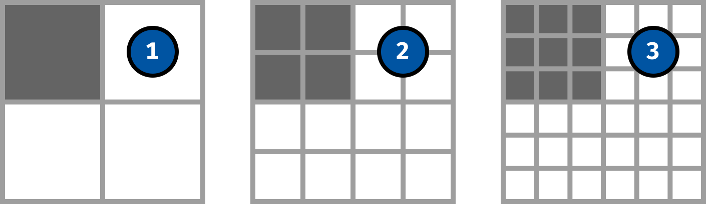

## Publisher 2 · 2020
Erscheinungsdatum · 2020

## Lizenzen
Dieser Text ist von Stefan Huber unter der Lizenz [CC-BY-SA 4.0](https://creativecommons.org/licenses/by-sa/4.0/) veröffentlicht. [Publisher](https://publisher.ch/) erhält das Recht die Inhalte ohne Copyleft (Share Alike) zu publizieren.

[Bilder für Print (pdf)](./css-units_graphics_print.pdf)

# Masseinheiten im Web – relative oder absolute Angaben

<lead>

Grössenangaben in Illustrations- und Print-Produkten sind meist einfach zu verstehen. Sie bilden ein globales und steifes Koordinatensystem ab. Im Web sind wir aber froh, wenn wir verschiedene Masseinheiten haben, die sich an unterschiedliche Gegebenheiten anpassen können.

</lead>

## Masseinheiten
## Masseinheiten
Seit dem ausgehenden 18. Jahrhundert gibt es mit dem Meter ein standardisiertes Längenmass, das die Kommunikation über Dimensionen vereinfacht. Da wichtige Vertreter der frühen digitalen Grafikprogramme in Amerika beheimatet waren, basieren die Basis-Technologien für die Grafische Industrie häufig noch immer auf Zoll-Angaben. So werden die Massangaben bei PDF zum Beispiel intern in Einheiten von 1&frasl;72-Zoll gespeichert. Das ist der sogenannte DTP-Punkt.

Ein wenig anders verhält es sich bei Webseiten in HTML. Als im Dezember 1996 der erste Standard für Cascading Style Sheets (CSS) veröffentlicht wurde, waren in dieser Spezifikation bereits zwei Typen von Masseinheiten definiert: relative und absolute. Für damalige Verhältnisse fast schon visionär kann man da lesen: «Style sheets that use relative units will more easily scale from one medium to another.» (Formatvorlagen, die relative Einheiten verwenden, lassen sich leichter von einem Medium zum anderen skalieren.) Damals war diese Aussage noch vor dem Hintergrund zu verstehen, dass Websites nicht selten ausgedruckt wurden und somit ein Medienwechsel vollzogen wird. Heute ist die gedruckte Website ein zu vernachlässigender Faktor bei der Wahl einer Masseinheit. Vielmehr ist heute Rücksicht auf verschiedene Ausgabegrössen zu nehmen. Diverse Geräteklassen (Mobile, Tablet, Desktop) haben ganz unterschiedliche Anforderungen, und um nicht alle Grössendefinitionen mehrfach zu schreiben, werden viele Dimensionen durch relative Angaben definiert.

## Absolute Angaben
Die wohl am häufigsten verwendete absolute Masseinheit im Webdesign ist die Einheit Pixel, abgekürzt `px`. Wenn also ein farbiges Quadrat mit `200px` Kantenlänge festgelegt wird, weiss man, dass es genau so gross auf dem Bildschirm erscheinen wird, wie ein Bild mit einem Inhalt von 200 × 200 px. Viel mehr kann man dazu aber nicht sagen. Denn die effektive Grösse am Gerät des Betrachters kann nicht vorhergesagt werden. Je nach Bildschirmgrösse und Auflösungsdichte des Geräts kann sie variieren. Nicht einmal die intuitive Annahme, dass ein im CSS definiertes Pixel auch ein Pixel auf dem Bildschirm erzeugt, ist richtig. Vielmehr spielt heute die «device pixel ratio» des Geräts eine entscheidende Rolle – ein Verhältnis zwischen Geräte-Pixel und CSS-Pixel der vom Hersteller definiert wird.

 

  

    

      

        

            

            

              

                

                  200 × 200 px
                

              

            

        

      

    

  

  

    

    

      

        

            

            

              

                

                  200 × 200 px
                

              

            

        

      

    

  

*Dieselbe Grössendefinition in Pixeln erscheint auf verschiedenen Bildschirmen ganz anders.*

## CSS zu Bild
Doch warum erscheinen die Pixel unterschiedlich gross? Die Ausgabe einer Website wird im Browser von einem Renderer gerastert. Je nach Fähigkeit des Screens erzeugt der Renderer ein «Bild» der auszugebenden Elemente. Nachfolgend die Darstellung von einem Bildschirm mit «einem» dunklen Pixel oben links, welches in CSS mit `width: 1px` und `height: 1px` definiert wurde.

 

1. Rendering für ein normales Gerät
2. Rendering für ein Retina-Gerät mit einem «device pixel ratio» von 2
3. Rendering für ein Retina-Gerät mit einem «device pixel ratio» von 3

## Bild zu Gerät

Je nach Auflösungsdichte und Spezifikation des Geräts werden dann die errechneten Daten auf dem Display ausgegeben. Bei LCD-Displays wird jeder Pixel über ein dreigeteiltes Lichtelement mit den gefilterten Farben Rot, Grün, Blau erzeugt. Bei einem modernen OLED-Display bestehen die Pixel aus einzeln angesteuerten farbigen LEDs.

 

1. Darstellung auf normalem LCD-Display
2. Darstellung auf Retina-LCD-Display mit einem «device pixel ratio» von 2
3. Darstellung auf Retina-OLED-Display mit einem «device pixel ratio» von 3

Natürlich ergibt die Verdoppelung von Pixeln keine bessere Qualität, aber bei Text oder Bildern ist die erweiterte Auflösung hilfreich, um die Schärfe und den Detailreichtum zu erhöhen.

 

*Die iOS Systemschrift (San Francisco Pro Text Regular) bei 17 px auf einem iPhone&nbsp;X. (Foto)*

Man sieht an den Beispielen, dass die Ausgabe sehr stark von der Hardware abhängt. Welche Dimension aber ein Pixel effektiv hat, wurde bei der ganzen Berechnung nicht berücksichtigt. Dies ist von Hersteller zu Hersteller anders, wodurch auch die Abbildungsgrösse uneinheitlich wird.

## Weitere absolute Masseinheiten
Neben der Masseinheit `px` gibt es noch weitere absolute Masseinheiten. So gibt es zum Beispiel `mm` für Millimeter oder `in` für Zoll (engl inch). Diese werden jedoch selten verwendet, da sie ausser bei der Druckausgabe fast keine Rolle spielen. Und auch für den Druck dienen diese Angaben meist nur zur Definition der Druckränder, da die Typografie oder der Seitenaufbau meist relativ formatiert wird.

## Relative Masseinheiten
Eine der wohl am meisten verwendete CSS-Einheit ist das Prozent, `%`. Sie wird vor allem für Breitenangaben genutzt. Die Angabe in Prozent bezieht sich dabei immer auf das umschliessende Objekt. Diese Aufteilung bleibt proportional gleich – unabhängig vom Viewport (Bildschirmausschnitt). Auch lassen sich damit zum Beispiel (mit Tricks) Bilder proportional verkleinern und vergrössern, ohne das Bildverhältnis zu verändern.

 

  

    

      

        

            

            

              

                

                  65 %
                

                

                  30 %
                

              

            

        

      

    

  

  

    

    

      

        

            

            

              

                

                  65 %
                

                

                  30 %
                

              

            

        

      

    

  

## EM – relativ zu was schon wieder?
Mit der Einheit `em` wird die Grösse in Relation zur aktuellen Schriftgrösse festgelegt. Dabei kann diese Einheit – wie ebenfalls alle anderen hier besprochenen – nicht nur auf Schrift angewandt werden, sondern auch auf beliebige andere Dimensionen (Grösse, Position, …). Dennoch ist die Bezugsgrösse, worauf sich `em` bezieht die Schriftgrösse. In Gestaltungen ist dies äusserst nützlich, da somit die Angabe in einer Abhängigket zur momentanen Schrftgrösse beschrieben wird und eine skallierung der Schrift auch eine skallierung anderer Elemente ergibt. Da sich die Angabe immer auf das umschliessende Element bezieht, ist die Verschachtelung der Komponenten entscheidend.

 

  

    

      

        

            

            

              

                Font: 15 px
                

                  Font: 2 em (30 px)
                  

                    Font: 2 em (60 px)
                  

                

              

            

        

      

    

  

  

    

    

      

        

            

            

              

                Font: 10 px
                

                  2 em
                  

                    2 em
                  

                

              

            

        

      

    

  

*Bei diesem Beispiel wurde die Schriftgrösse der Seite jeweils an den Viewport angepasst. Die untergeordneten Elemente haben alle eine Schriftgrösse von `2em`.*

## REM – relativ zum Obersten
Bei der Einheit `rem` wird die Grösse immer relativ zur Schriftgrösse des obersten Elements im Dokument (HTML-Tag) angegeben. So können Titelhierarchien bequem aufgebaut werden, ohne dabei auf die Verschachtelung zu achten. Bei der Nutzung anderer Viewports muss dann nur noch die Schriftgrösse entsprechend des HTML-Tag angepasst werden. Sowohl `em` wie auch `rem` sind aus der Perspektive von klassischen Masssystemen schwer vorstellbar. Dort ist meist eine möglichst einheitliche Bezugsgrösse gewünscht. Ein Konzept, bei dem eine Dimension sich an einer momentanen Schriftgrösse orientiert scheint fast schon absurd, ist aber – wenn man sich daran gewöhnt hat – sehr hilfreich.

 

  

    

      

        

            

            

              

                Font: 15 px
                

                  Font: 2 rem (30 px)
                  

                    Font: 2 rem (30 px)
                  

                

              

            

        

      

    

  

  

    

    

      

        

            

            

              

                Font: 10 px
                

                  2 rem
                  

                    2 rem
                  

                

              

            

        

      

    

  

*Im Gegensatz zur Definition mit `em` kann nun ohne Rücksicht auf Verschachtelung gearbeitet werden.*

## Viewportabhängige Einheiten
Weitere relative Einheiten, die ab und an noch gebraucht werden, sind die viewportabhängigen Einheiten. Sie beziehen sich also auf die Grösse des Viewports, in dem die Inhalte betrachtet werden. Hier eine Übersicht von viewportabhängige Einheiten:

* `vh` – 1 % der Viewporthöhe
* `vw` – 1 % der Viewportbreite
* `vmin` – 1 % der schmaleren Viewportdimension (bei Hochformat also die Breite und bei Breitformat die Höhe)
* `vmax` – 1 % der grösseren Viewportdimension (bei Hochformat also die Höhe und bei Breitformat die Breite)

 

  

    

      

        

            

            

              

                

                  90 vw × 50 vh
                

              

            

        

      

    

  

  

    

    

      

        

            

            

              

                

                  90 vw × 50 vh
                

              

            

        

      

    

  

*Dieselbe auf den Viewport bezogene Grössendefinition erscheint auf verschiedenen Bildschirmen jeweils angepasst.*

## Mischung
Nicht eigentliche eine Masseinheit von CSS, aber dennoch ideal zur Massangabe, ist die so genannte `calc()`-Funktion. Mit ihr lassen sich beliebige CSS-Einheiten mischen. Möchte man zum Beispiel ein Objekt auf die Viewportbreite skallieren, aber links und rechts noch einen Rand von je 10 px lassen, so könnte man die Breite wie folgt angeben: `calc(100vw - 20px)`.

## Fazit
Nebst den hier gezeigten Massangaben gibt es noch diverse andere. Jedoch werden diese nur sehr selten gebraucht. Oder wollten Sie schon mal eine Grössenangabe abhängig von der Breite der Ziffer Null tätigen? In CSS hätten Sie mit der Einheit `ch` die Chance dazu…
Das mentale Modell, wie man eine Gestaltung proportioniert, erscheint für eine Website auf den ersten Blick eher komplex. Jedoch erkennt man in der Anwendung schnell, dass man sich viel Arbeit bei der Viewport-Adaption durch den bewussten Einsatz der richtigen Masseinheit am richtigen Ort ersparen kann. Einer tollen Gestaltung von Mobile bis Desktop steht nichts mehr im Weg.

### Autor
Stefan Huber unterrichtet an der [Schule für Gestaltung Zürich](https://sfgz.ch/) im Lehrgang HF Interaction Design und ist als Web-Entwickler tätig.

